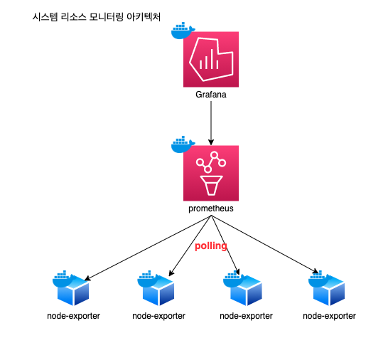

# prometheus
# node-exporter
# grafana

## build
- $ docker-compose up -d

## detail
- 마운트할 config 생성 : ${PWD}/etc/prometheus/prometheus.yml

### grafana
- dashboard 는 import 해서 사용
  - url : https://grafana.com/dashboards/22
  - 각 섹터별로 적절한 prometheus 쿼리 수정 필요
### 주의할 점
- data source를 먼저 구성하고 dashboard 순서로 구성
- grafana를 docker로 구성
  - 같은 물리적 서버에 docker로 구성!!
  - data source 추가 시 prometheus가 docker인 경우 호스트 입력 시 http://[container id]:9090 로 입력
  - /etc/hosts에 [container id] [docker ip] 정보 추가해야함.

## architecture

